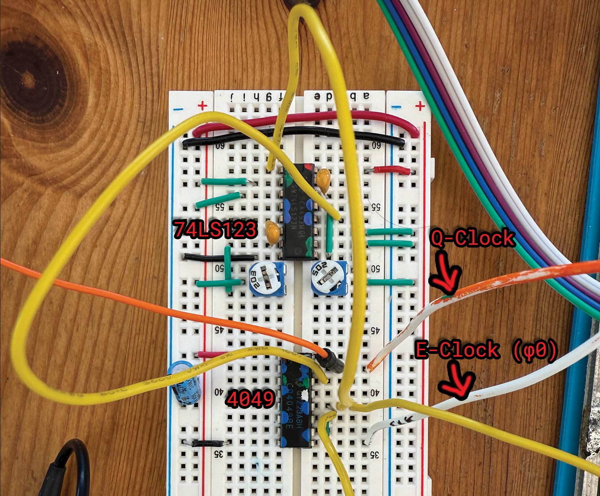
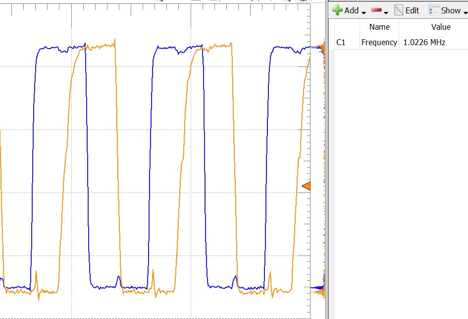
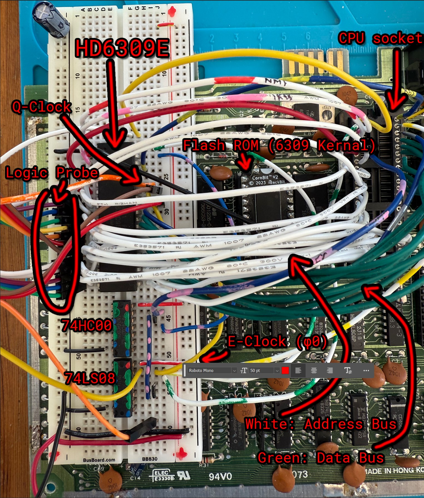

# Commodore-6309

This experimental project shows how to transplant and run a Hitachi 6309 CPU instead of the MOS 6510 on a Commodore 64.
A 6809 should also work, but we love the faster and more advanced 6309.
Be sure to read the disclaimer below.

# DISCLAIMER

This is an experimental project and may contain flaws and errors.  
I use a disposable C64, which I can sacrifice in the name of science.  
I am perfectly aware that this is a new, unofficial mod I have just barely tested, and I know I could fry/lose my C64 in case of any issue. I just don't care.  
Don't try this on your main C64 machine.  
  
**IMPORTANT**: You can damage your C64 if improper connections are made.  
We don't even know for sure if the C64 can run a 6309 for a long time without any damage.  
Also, you will certainly lose your warranty by opening the breadbox   ;-)  

Do not proceed further unless you accept that you are trying this mod...  

## AT YOUR OWN RISK !!!

# LICENSE

Creative Commons, CC BY

https://creativecommons.org/licenses/by/4.0/deed.en

Please add a link to this github project.

# CURRENT STATUS

_"Alive! It's alive! It's alive!"_

Prototype works with preliminary test Kernal ROM, running very simple code, such as a fixed-point Mandelbrot set generator.

As of 2024-Nov-02, a GAL16V8 has been added to the design to help handling signals.
Clock stretching seems to have resolved the conflict with VIC-II DMA access (e.g. bad-lines).
However, the prototype still has some timing issues, visible as flickering character lines on screen.

# INGREDIENTS

- C64. I have a classic 250407 motherboard, but this should work with all models (to be verified).
- Hitachi 6309E. Note the "E" at the end.
- Support Logic for clock quadrature: 74LS123, 4049, some resistors, some capacitors.
- Support Logic for 6510 to 6309 signals translation: GAL16V8.
- 40-pin socket to plug/solder the signal wires, because we don't want to alter the onboard CPU socket. We may want to plug the 6510 there again eventually ;-)
- Breadboard(s) for external logic. I use one for the clock and another for the signals translation.
- Lots of wires.
- Replacement Kernal ROM.

# SCHEMATICS

[TODO: Provide proper diagrams]

This is the clock adjustment and quadrature generator. It is based on the SuperPet schematics.  
It takes φ0 (C64 CPU clock) as input, this is sent through a 4049 to raise it from TTL to CMOS levels. This is used as the 6309 E-Clock.  
The same signal is fed to a 74LS123 to generate the quadrature Q-Clock that runs 90 degrees out of phase.  
NOTE: I like color marking pins of chips to prevent wrong connections: Green is input, Blue is output.

The variable resistors can be adjusted to define the shape and phase of the quadrature clock. These are there to debug the prototype, and can be replaced with fixed resistors of ideal value.

These are the clocks as fed to the 6309. Orange is φ0 (E-Clock), Blue is the generated Q-Clock.
They are a bit noisy in this prototype but work ok:

A GAL16V8 is used to translate some 6510 signals to 6309 signals.  
NOTE: The pictures here are old (pre-GAL), and show 74x logic chips. Pictures will be updated soon.  
Also note a lot of extra wires used to experiment and to feed the logic probe.  

# KERNAL ROM

The Kernal ROM for the prototype works with both 6309 and 6510 (they have different reset vectors).
At the moment, the Kernal only sets up the VIC-II and runs some test programs.
I use the _BackBit CornBit_ flash ROM to simplify development.

# PREPARATION

- Write the desired ".rom" file on a 8 KByte ROM (EPROM or Flash).
- Replace the original Kernal ROM with the 6309 ROM.
- Power on the system with the 6510. You should see the message "6510 detected. insert 6309 with adapter". This is to verify your ROM is programmed successfully. __Do NOT insert the 6309 directly in the 6510 socket__. You need the adapter circuit described in the schematics.
- Check the schematics.
- Implement the translation circuit as per schematics (which are not yet available... sorry).
- Double-check the schematics.
- Correct any errors.
- Triple-check the schematics and make sure you made no mistakes.
- Remove the 6510 and plug in its socket the 40-pin socket that connects the translation circuit to the 6309.
- Power on the C64. If you don't see a screen with red border, white background, and colored characters in less than 3 seconds, then turn off your C64 immediately and troubleshoot the circuit.
- At any time, you can plug-in the 6510 again to verify you didn't fry anything.

# RESULT

At the moment, the 6309 Kernal ROM only sets up the VIC-II and runs a test program, like printing text, running diagnostics or a Mandelbrot generator.
Exciting! ;-)  
Ahem... better demos will come in the future.

This is the ROM execution visualized using a logic probe. Open the image in a new window to see it bigger.  
Note that the first thing the 6309 does is fetching the 16-bit reset vector at $FFFE/$FFFF.  
Then it begins executing the ROM from address $E000.  

NOTE: My logic probe only has 16 inputs, so I had to use the upper two bits for Clock and R/W. Decoded addresses in hex at the bottom will have incorrect bit 14 and 15.

And this is my fixed point Mandelbrot generator. The 40x25 image is generated in about 1.5 seconds using max_iters = 16.  
Note the random (flickering) missing characters pixel lines, due to timing issues still to fix.

# NEXT STEPS

- Design prototype PCB (open source) to improve timing precision and make prototyping more comfortable.

