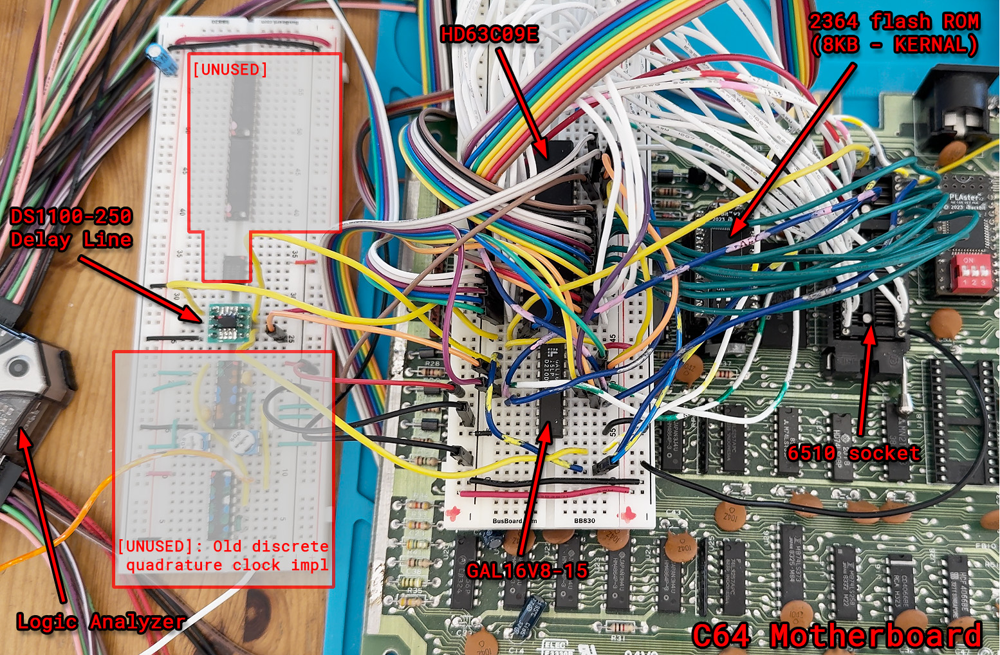
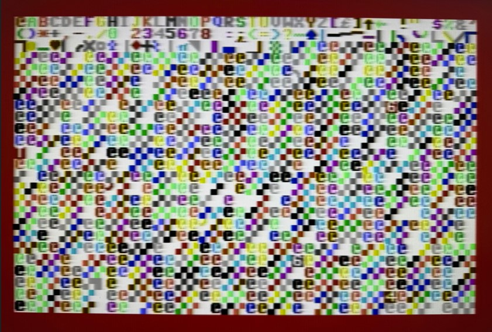
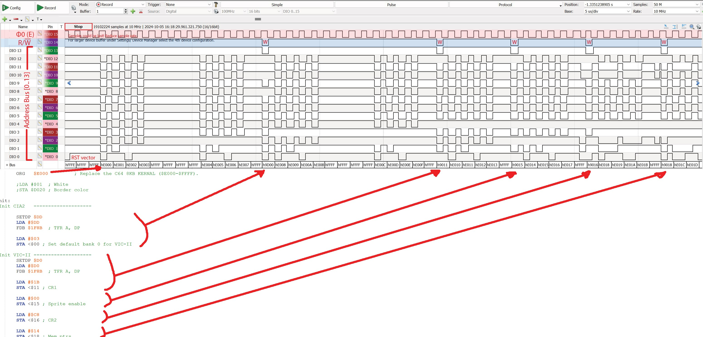
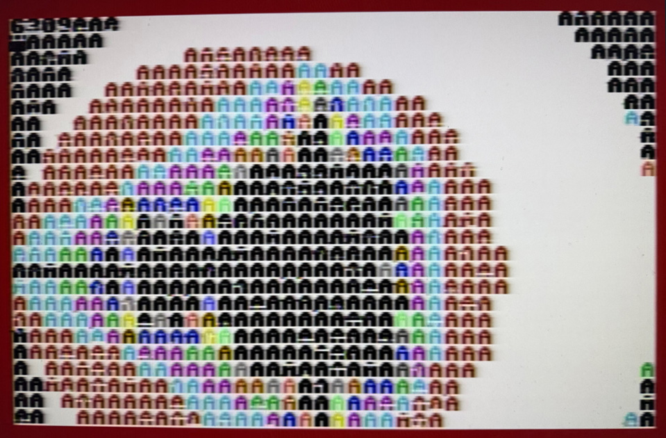

# Commodore-6309

This experimental project shows how to transplant and run a Hitachi 6309 CPU instead of the MOS 6510 on a Commodore 64.
A 6809 should also work, but we love the faster and more advanced 6309.
Be sure to read the disclaimer below.

# DISCLAIMER

This is an experimental project and may contain flaws and errors.  
I use a disposable C64, which I can sacrifice in the name of science.  
I am perfectly aware that this is a new, unofficial mod I have just barely tested, and I know I could fry/lose my C64 in case of any issue. I just don't care.  
Don't try this on your main C64 machine.  
  
**IMPORTANT**: You can damage your C64 if improper connections are made.  
We don't even know for sure if the C64 can run a 6309 for a long time without any damage.  
Also, you will certainly lose your warranty by opening the breadbox   ;-)  

Do not proceed further unless you accept that you are trying this mod...  

## AT YOUR OWN RISK !!!

# LICENSE

Creative Commons, CC BY

https://creativecommons.org/licenses/by/4.0/deed.en

Please add a link to this github project.

# CURRENT STATUS

_"Alive! It's alive! It's alive!"_

Prototype works with preliminary test Kernal ROM, running test code like a fixed-point Mandelbrot set generator.  
IRQ is working. FIRQ is also functional, but the C64 only has one IRQ signal, so we opted to support IRQ and disabled FIRQ.  
VIC-II raster interrupts are working.  
File loading from floppy drive is working (beta). Use a real 1541 drive or a 100% compatible modern device like the Pi1541. Next step is support for OS bootstrap (e.g. NitrOS-9 loader).

There are still problems when sprites are enabled. Problem is being investigated.

# INGREDIENTS

- C64. I have a classic 250407 motherboard, but this should work with all models (to be verified).
- Hitachi 63C09E. Note the "E" at the end.
- Support Logic for clock delays and quadrature: DS1100Z-50 and DS1100Z-250 delay lines.
- Support Logic for 6510 to 6309 signals translation: GAL16V8. I use a GAL16V8D-15, but similar parts should work.
- 40-pin socket to plug/solder the signal wires, because we don't want to alter the onboard CPU socket. We may want to plug the 6510 there again eventually ;-)
- Breadboard(s) for the three external chips (63C09E, GAL16V8, DS1100Z-250).
- Lots of wires.
- Replacement 6309 Kernal ROM. I use BackBit's CornBit (2364) Flash ROM.

# SCHEMATICS

See the hardware section: [hardware](./hardware/)

A **proper** PCB is work in progress.  

Here is how the current prototype looks like (half of the wires are for debugging using the logic analyzer):

# KERNAL ROM

The Kernal ROM for the prototype works with both 6309 and 6510 (they have different reset vectors).
At the moment, the Kernal only sets up the VIC-II and runs some test programs.
I use the _BackBit CornBit_ flash ROM to simplify development.

# PREPARATION

- Write the desired ".rom" file on a 8 KByte ROM (EPROM or Flash).
- Replace the original Kernal ROM with the 6309 ROM.
- Power on the system with the 6510. You should see the message "6510 detected. insert 6309 with adapter". This is to verify your ROM is programmed successfully. __Do NOT insert the 6309 directly in the 6510 socket__. You need the adapter circuit described in the [schematics](./hardware/).
- Check the schematics.
- Implement the translation circuit as per schematics .
- Double-check the schematics.
- Correct any errors.
- Triple-check the schematics and make sure you made no mistakes.
- Remove the 6510 and plug in its socket the 40-pin header that connects the translation circuit to the 6309.
- Power on the C64. If you don't see a screen with red border, white background, and colored characters in less than 3 seconds, then turn off your C64 immediately and troubleshoot the circuit.
- At any time, you can plug-in the 6510 again to verify you didn't fry anything.

# RESULT

At the moment, the 6309 Kernal ROM only sets up the VIC-II, CIA1, and runs a test program, like printing text, running diagnostics and a Mandelbrot generator.  
IRQ is supported (e.g. VIC-II raster interrupts).  
Better demos will come in the future.

This is the ROM execution visualized using a logic probe. Open the image in a new window to see it bigger.  
Note that the first thing the 6309 does is fetching the 16-bit reset vector at $FFFE/$FFFF.  
Then it begins executing the ROM from address $E000.  

NOTE: My old logic probe only had 16 inputs, so I had to use the upper two bits for Clock and R/W. Decoded addresses in hex at the bottom will have incorrect bit 14 and 15.

  
And this is my fixed point Mandelbrot generator. The 40x25 image is generated in about 1.5 seconds using max_iters = 16.  
Note the random missing characters pixel lines, due to timing issues that have been fixed after taking this picture.

# NEXT STEPS

- Design prototype PCB daughterboard the plugs into the 6510 socket. This will improve timing precision and make prototyping more comfortable.
- Implement a minimalistic CPU monitor in ROM.
- Port the 586220-Diagnostics ROM to 6309, supporting harness.
- Improve the prototype and design a final version using the Expansion Port.

