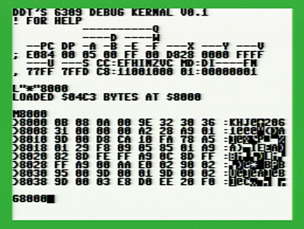
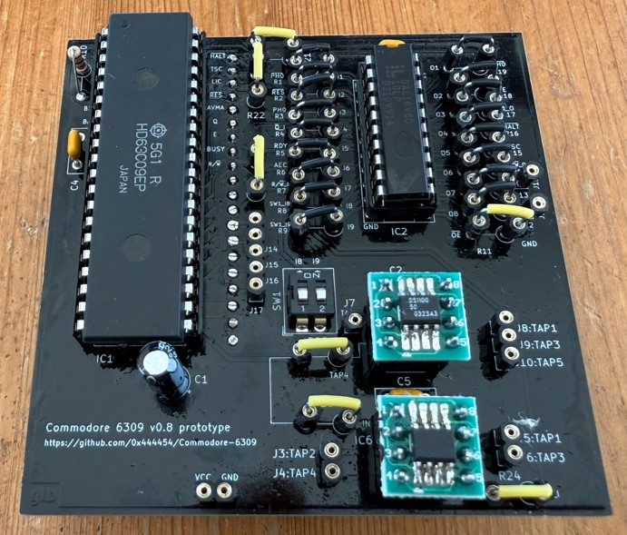
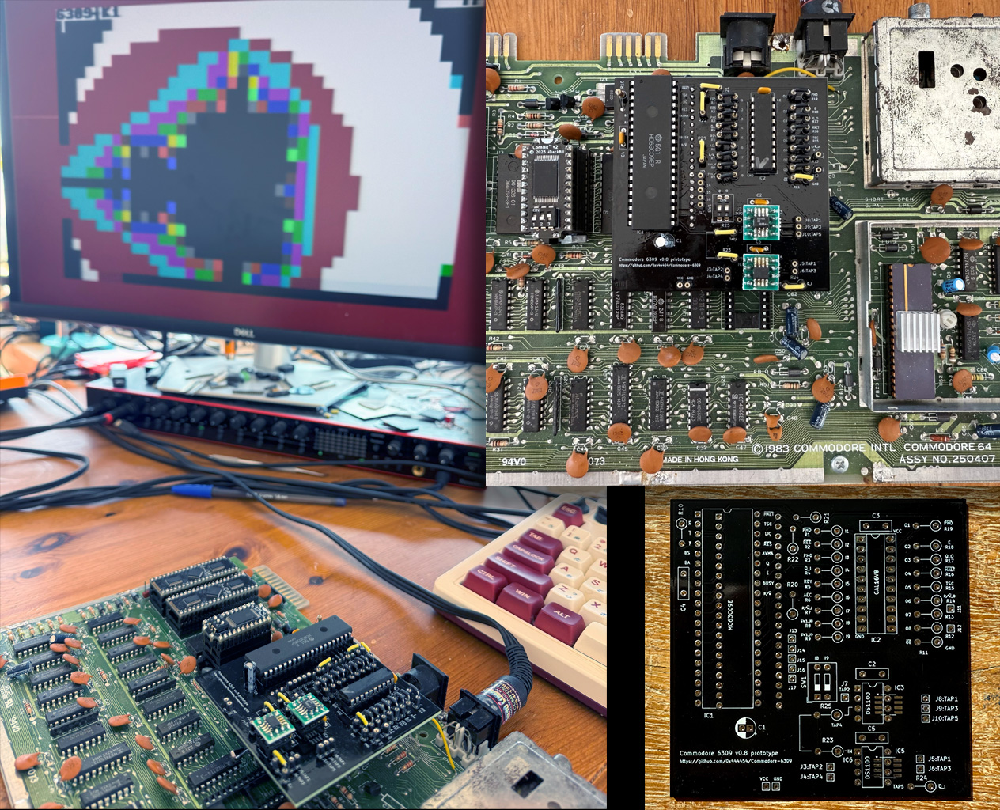

# Commodore-6309

This experimental project shows how to transplant and run a Hitachi 6309 CPU instead of the MOS 6510 on a Commodore 64.  
Be sure to read the disclaimer below.

  
*The 6309 machine code monitor in the v0.1 Kernal,*  
*showing the ample register set of the 6309*

# DISCLAIMER

This is an experimental project and may contain flaws and errors.  
I use a disposable C64, which I can sacrifice in the name of science.  
I am perfectly aware that this is a new, unofficial mod I have just barely tested, and I know I could fry/lose my C64 in case of any issue. I just don't care.  
Don't try this on your main C64 machine.  
  
**IMPORTANT**: You can damage your C64 if improper connections are made.  
We don't know for sure if the C64 can run a 6309 for a long time without any damage (though I had no issues with many hours of debugging).
Also, you will certainly lose your warranty by opening the *breadbox*   ;-)  

Do not proceed further unless you accept that you are trying this mod...  

## AT YOUR OWN RISK !!!

# LICENSE

Creative Commons, CC BY

https://creativecommons.org/licenses/by/4.0/deed.en

Please add a link to this github project.

# CURRENT STATUS

_"Alive! It's alive! It's alive!"_

Prototype works with Kernal v0.1 (alpha) ROM, containing a machine-code monitor with disk load functions (including autoboot).  
Interrupts are working, including FIRQ, however the C64 only has one IRQ signal and the adapter PCB uses IRQ (unmodified).
VIC-II raster interrupts are working.  
File loading from floppy drive is working (beta). Use a real 1541 drive or a 100% compatible modern device like the Pi1541. Autoboot is supported (wait 5 seconds after power on). File loading seems to fail randomly on PAL systems (to be investigated).  
There are still problems when sprites are enabled (to be investigated).
Development is done on a NTSC C64 with motherboard revision 250407 (the most common). 

# COMPATIBILITY

Motherboard compatibility table for the current v0.8 PCB:  
- &check; = Working.  
- ? = Untested.  
- &cross; = Compatible adapter configuration not yet found.   

| Mobo rev | VIC-II | Supported | Notes |
| :---: | :---: | :---: | --- |
| 250407 | NTSC  | &check; | |
| 250407 | PAL  | &check; | |
| 250425 | NTSC  | &check; | |
| 250425 | PAL  | ? | |
| 250466 | NTSC  | ? | |
| 250466 | PAL  | ? | |
| 250469 | NTSC  | ? | C64C, short-board (SuperPLA) |
| 250469 | PAL  | &cross; | C64C, short-board (SuperPLA), working cfg not yet found |
| 326298 | Any  | &cross; | Unsupported due to PCB physical dimensions |

NOTE: C64 systems use very different components (Commodore used whatever was cheaper at the time of production), so even two C64 machines using the same motherboard and VIC-II revision may behave differently.  
If you have issues with the default 6309 adapter configuration (i.e. using IC3-TAP4 to feed IC5-IN), then try IC3-TAP5.

# INGREDIENTS

- A Commodore 64. I have a classic breadbin with motherboard rev 250407, but this should work with other models (to be verified). Motherboard rev 326298 (the oldest) is unlikely to work, due to physical constraints.
- The adapter board [PCB](#pcb-and-schematics). Alternatively, you may also use a breadboard and and wire (lots of wires) according to schematics. :-)
- Hitachi 63C09E. Note the "E" after the "9". These chips are usually marked "HD63C09**E**P", where "HD" stands for "Hitachi Device", the "E" stands for "External clock", and the "P" denotes the plastic package (DIP-40).
- Support Logic for clock delays and quadrature: DS1100Z-50 and DS1100Z-250 delay lines. I like using DIP8 chips in socket (for easy swap), but the PCB supports also SOP8 (surface mounted). NOTE: I tried an old DS1000-50 (one thousand) and I got stability issues, so be sure to get the DS1100 (one thousand and one hundred).
- Support Logic for 6510 to 6309 signals translation: GAL16V8. I use a GAL16V8D-10, but parts with different timings should work (maybe up to 25 ns ? - To be tested).
- Sockets, headers, capacitors, resistors and jumpers (see PCB project for components list). Note that all but 1 resistor in the PCB are 0 (zero) Ω, so you can simply replace them with jumper wires.
- Replacement 6309 Kernal ROM. I use BackBit's CornBit (2364) Flash ROM.

# PCB AND SCHEMATICS

See the hardware section: [hardware](./hardware/)

The PCB has been designed by Gary Becker (thanks !). Note that the current PCB v0.8 is __intended for debugging purposes__ and requires soldering several jumpers and probe points that won't be in the final simplified version.

The PCB is available as a shared project on [PCBWay](https://www.pcbway.com/project/shareproject/Commodore_6309_A_new_CPU_for_the_Commodore_64_4cdcbc60.html). Again, please note that the current version is not a final product, is intended for hardware debugging, and comes with absolutely no warranty.

The PCB is derived from the one Gary designed for the [liber809](https://github.com/boisy/liber809) project targeting Atari 8-bit computers. Kudos to Boisy Pitre for the great support !

# KERNAL ROM

Yes, Commodore says "Kernal" not "Kernel" :-)  

The 8KB Kernal ROM for the prototype works with both 6309 (adapted via PCB) and 6510, as they have different reset vectors, so we can store both 6309 and 6510 initialization code.  
At the moment:

- The 6510 code only displays a message telling that a 6510 has been detected. Don't expect any more than that.
- The 6309 code is a machine-code monitor with disk-load and autoboot capabilites.

I use the _BackBit CornBit_ flash ROM to simplify development. This requires a custom ROM programmer, but has nice features like hosting multiple ROMs and select them using jumpers.  
Other Flash ROM products can be programmed using a standard EPROM programmer like the XGecu.  

Note that the Kernal ROM in newer C64C models using motherboard revision 250469 is stored together with the BASIC ROM in a single 16KB chip (8KB BASIC + 8 KB KERNAL). Our adapter disables the BASIC ROM, so you can simply duplicate the KERNAL ROM to obtain a 16KB file to write to your ROM. Only the Kernal part will be used.

# PREPARATION
- Remember: Check that your C64 board revision is supported. Unsupported/untested boards __may__ work with different jumper settings. Feedback is welcome.
- Write the [JED](./release/GAL16V8_6309E.jed) binary file to program the GAL16V8D. I use a XGecu T48 programmer.
- Assemble the PCB. Note that the 10μF capacitor needs to be mounted with the + leg on the left. Ignore the small "+" symbol on the silkscreen, and check the picture of the assembled PCB above. Note that all but 1 resistor in the PCB are 0 (zero) Ω, so you can simply replace them with jumper wires.
- NTSC vs PAL: Default jumpers for NTSC. For PAL, change jumper "R25" from IC3 TAP4 to IC3 TAP5.
- Write the [6309 Kernal](./release/1-k6309.rom) or other ".rom" file to test on your replacement ROM.
- Replace the original C64 Kernal ROM (U4) with the 6309 Kernal ROM.
- Power on the system with the 6510. You should see the message "6510 detected. insert 6309 with adapter". This is to verify your ROM is programmed successfully. __Do NOT insert the 6309 directly in the 6510 socket__. You need the adapter PCB, or your breadboard version of the adapter circuit described in the [schematics](./hardware/).
- Remove the 6510 CPU and store it safely.
- Plug the adapter PCB with the 6309 CPU in the 6510 socket. Be sure to insert the PCB correctly, i.e. the writings on the PCB are not upside down (see picture below). Then look below the PCB, and check that all 40 pins are inside the 6510 socket.
- Power on the C64. If you don't see a screen with red border, white background, and a text message in less than 3 seconds, then turn off your C64 immediately and troubleshoot the adapter.
- At any time, you can remove the adapter PCB and plug-in the 6510 again to verify you didn't fry anything. The 6309 Kernal ROM also supports the 6510 and should show some text and sprites.

# KERNAL COMMANDS

The Kernal starts in autoboot mode.  
After 5 seconds, it will load the first file on disk ("*") at $8000, and start exectuing as soon as load complete successfully.  
You can press any key to cancel autoboot, and use the embedded machine-code monitor.  

## MONITOR COMMANDS

Here are the commands supported in v0.1. More will be added in the future.  
| Command | Description |
| --- | --- |
| G [addr] | JMP to addr |
| I | System Info |
| J [addr] | JSR to addr |
| L ["filename"] [addr] | Load filename at addr |
| M [<start> [<end>]] | Display mem (hex) |
| N [<start> [<end>]] | Display mem (bin) |
| R | Show registers |
| T [num] | Launch a test |
| ; [regvalues] | Edit registers |
| > addr [byte] ... | Edit mem |

You can also use the combo SHIFT+RUN/STOP to bootstrap from disk.
  
# NEXT STEPS

- Port NitrOS-9 to the Commodore-6309.
- Add commmands to the machine code monitor, also allowing to launch tests and benchmarks.
- Port the 586220-Diagnostics ROM to 6309, supporting harness.
- Improve the prototype and design a final version using the Expansion Port and Kernal replacement.

  

